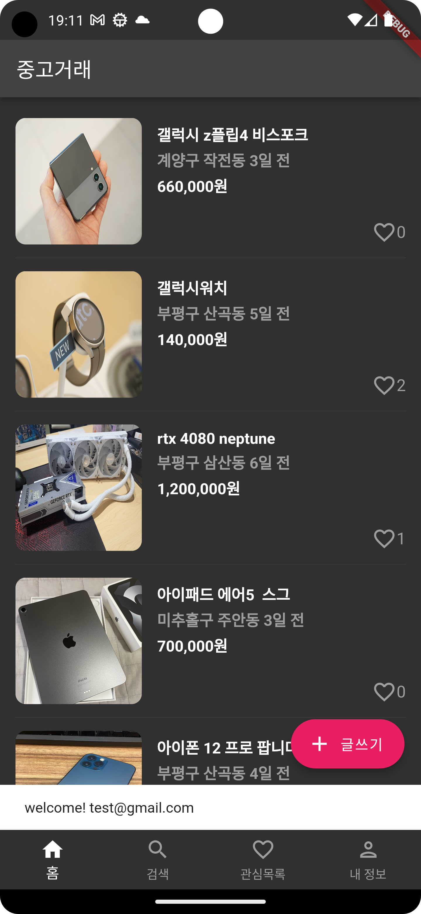
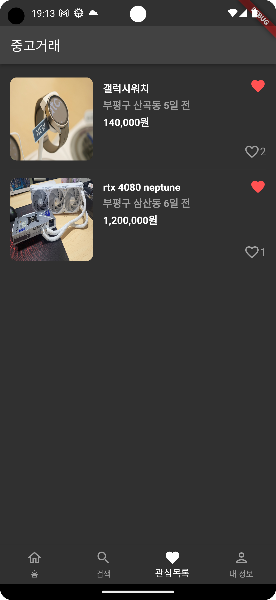
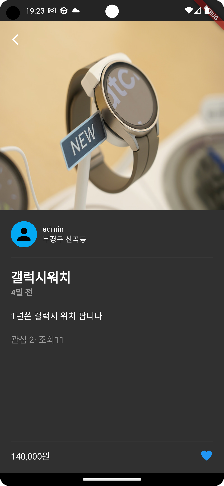

# trading_stuff_app
make trading stuff app in flutter using firebase database

# Environment
Android Studio Electric Eel | 2022.1.1 Patch 1  
Flutter 3.10.2  
Dart 3.0.2  

# Preview

# update
* 2023_06_04  
  Firebase 연동  
  로그인, 회원가입 기능 추가  
  기본 UI 구현  

* 2023_06_05  
  게시물 조회 기능 추가  
  게시물 검색 기능 추가  

* 2023_06_06  
  관심목록에 추가/제거 기능 추가 
  게시물의 관심 및 조회 수 기능 추가  

* 2023_06_11  
  내 정보 페이지 구현  
  Firebase 쿼리 코드 수정  

* 2023_06_12  
  자신이 올린 게시물들을 모아서 볼 수 있는 기능 추가 
  자신의 게시물은 클릭해도 조회수가 업데이트 되지 않도록 변경

* 2023_06_12  
  게시물 추가 페이지 추가  

* 2023_06_15  
  게시물 이미지 삽입 기능 추가  
  게시물 카테고리 선택 기능 추가  

* 2023_06_16  
  Firebase 사진 업로드 기능 추가